# Практическое занятие №12: REST API с OpenAPI/Swagger документацией для управления заметками

## Выполнил: Туев Д. ЭФМО-01-25

## Описание проекта

REST API сервис для управления заметками пользователя с интеграцией JWT (JSON Web Tokens) для аутентификации и авторизации, дополненный полной OpenAPI/Swagger документацией. Система реализует полный цикл управления заметками (CRUD операции) с защитой через Bearer token. Пользователи могут регистрироваться, логиниться, получать access и refresh токены, и управлять своими заметками. Архитектура предусматривает хранение refresh token в Redis с TTL, что позволяет контролировать жизненный цикл сессии. **Основное отличие от Practice-11** — интеграция SpringDoc OpenAPI 2.8.5 с автоматической генерацией интерактивной документации Swagger UI и полной аннотацией всех контроллеров и DTOs для самодокументирования API.

## Стек технологий

В проекте используются следующие технологии и инструменты:
- **Spring Boot 3.5.7** — основной фреймворк приложения
- **Spring Web** — для разработки REST API
- **Spring Security** — управление аутентификацией и авторизацией
- **Spring Data JPA** — интеграция с PostgreSQL через Hibernate
- **Spring Data Redis** — хранилище refresh token с TTL
- **Spring Validation** — валидация входных данных
- **Spring Boot Actuator** — мониторинг и управление приложением
- **PostgreSQL** — реляционная база данных для пользователей и заметок
- **Redis** — in-memory хранилище для refresh токенов
- **JJWT 0.12.3** — библиотека для работы с JWT токенами
- **BCrypt** — хеширование паролей
- **Lombok** — сокращение шаблонного кода
- **SpringDoc OpenAPI 2.8.5** — автоматическая генерация OpenAPI/Swagger документации  **НОВОЕ**
- **Swagger UI** — интерактивная документация API  **НОВОЕ**
- **Maven** — управление зависимостями и сборка проекта
- **Java 17** — язык программирования

## Поддерживаемые запросы

**Легенда:** 🔓 Открытый доступ · 🔒 Требуется ACCESS token · 🛡️ Только USER/ADMIN

### API v1 (Authentication & Notes Management)

| Метод | Эндпоинт | Параметры | Действие | Ответ | Требования | Тело ответа |
|-------|----------|-----------|----------|-------|-----------|-------------|
| 🔓 **POST** | `/auth/register` | - | Регистрация пользователя | `201 CREATED` | Нет | `AuthResponse` с ACCESS и REFRESH token |
| 🔓 **POST** | `/auth/login` | - | Вход в систему | `200 OK` | Нет | `AuthResponse` с ACCESS и REFRESH token |
| 🔒 **POST** | `/auth/logout` | - | Выход из системы | `200 OK` | ACCESS token | `AuthResponse` |
| 🔓 **POST** | `/auth/refresh` | - | Обновить ACCESS token | `200 OK` | REFRESH token в теле | `AuthResponse` (новые токены) |
| 🔓 **GET** | `/api/v1/notes/health` | - | Проверка здоровья сервера | `200 OK` | Нет | `{"status":"ok"}` |
| 🔒 **POST** | `/api/v1/notes/` | - | Создать заметку | `201 CREATED` | ACCESS token | `NoteDTO` |
| 🔒 **GET** | `/api/v1/notes/` | - | Получить все заметки | `200 OK` | ACCESS token | Список `NoteDTO` |
| 🔒 **GET** | `/api/v1/notes/{id}` | `id` | Получить заметку по ID | `200 OK` | ACCESS token | `NoteDTO` |
| 🔒 **PUT** | `/api/v1/notes/{id}` | `id` | Заменить заметку полностью | `200 OK` | ACCESS token | `NoteDTO` |
| 🔒 **PATCH** | `/api/v1/notes/{id}` | `id` | Частично обновить заметку | `200 OK` | ACCESS token | `NoteDTO` |
| 🔒 **DELETE** | `/api/v1/notes/{id}` | `id` | Удалить заметку | `200 OK` | ACCESS token | - |

### 📖 Интерактивная документация

Полная документация доступна через **Swagger UI**:
- **URL:** http://localhost:8080/swagger-ui/index.html
- **OpenAPI Schema:** http://localhost:8080/v3/api-docs
- **Функционал:**
  - Просмотр всех эндпоинтов с описаниями
  - Примеры запросов и ответов
  - Прямое тестирование API через "Try it out"
  - Валидация схемы запроса/ответа
  - Интерактивные примеры HTTP статусов

## Формат данных

### Тело запроса (POST /auth/register, POST /auth/login)

```json
{
  "email": "user@example.com",
  "password": "securePassword123"
}
```

### Тело запроса (POST /api/v1/notes/)

```json
{
  "title": "My First Note",
  "content": "This is my first note content"
}
```

### Тело запроса (PUT /api/v1/notes/{id})

```json
{
  "title": "Updated Title",
  "content": "Updated content here"
}
```

### Тело запроса (PATCH /api/v1/notes/{id})

```json
{
  "fields": {
    "title": "Only Title Updated",
    "content": "Or only content"
  }
}
```

### Тело запроса (POST /auth/refresh)

```json
{
  "refreshToken": "eyJhbGciOiJIUzI1NiIsInR5cCI6IkpXVCJ9..."
}
```

### Ответ (POST /auth/register, POST /auth/login, POST /auth/refresh)

```json
{
  "tokens": [
    {
      "token": "eyJhbGciOiJIUzI1NiIsInR5cCI6IkpXVCJ9...",
      "tokenType": "ACCESS_BEARER",
      "issuedAt": "2025-12-14T20:15:00Z",
      "expiresAt": "2025-12-14T21:15:00Z"
    },
    {
      "token": "eyJhbGciOiJIUzI1NiIsInR5cCI6IkpXVCJ9...",
      "tokenType": "REFRESH_BEARER",
      "issuedAt": "2025-12-14T20:15:00Z",
      "expiresAt": "2026-01-13T20:15:00Z"
    }
  ]
}
```

### Ответ (POST /api/v1/notes/, GET /api/v1/notes/{id}, PUT /api/v1/notes/{id}, PATCH /api/v1/notes/{id})

```json
{
  "id": 1,
  "title": "My First Note",
  "content": "This is my first note content",
  "createdAt": "2025-12-14T20:15:00Z",
  "updatedAt": "2025-12-14T20:15:00Z"
}
```

### Ответ (GET /api/v1/notes/)

```json
[
  {
    "id": 1,
    "title": "First Note",
    "content": "Content 1",
    "createdAt": "2025-12-14T20:10:00Z",
    "updatedAt": "2025-12-14T20:10:00Z"
  },
  {
    "id": 2,
    "title": "Second Note",
    "content": "Content 2",
    "createdAt": "2025-12-14T20:12:00Z",
    "updatedAt": "2025-12-14T20:12:00Z"
  }
]
```

### Заголовок (для защищённых эндпоинтов)

```
Authorization: Bearer <ACCESS_TOKEN>
```

## Структура проекта

```
my/learn/mireaffjpractice12/
├── config/
│   ├── EncodingConfig.java                     # Конфигурация BCrypt для хеширования паролей
│   ├── JwtConfig.java                          # Конфигурация JWT (secret, lifetime)
│   ├── RedisConfig.java                        # Конфигурация Redis подключения
│   ├── SecurityConfig.java                     # Конфигурация Spring Security + Swagger endpoints
│   └── SwaggerConfig.java                      #  НОВОЕ: Конфигурация OpenAPI/Swagger
├── controller/
│   ├── AuthController.java                     # Interface с @Tag и @Operation аннотациями
│   ├── HealthController.java                   # Interface для health check с @Operation
│   ├── NoteController.java                     # Interface с подробной Swagger документацией
│   ├── filter/
│   │   └── JwtRequestFilter.java               # Фильтр для валидации JWT токенов
│   └── impl/
│       ├── AuthControllerImpl.java              # Реализация аутентификации (идентична 11)
│       └── NoteControllerImplV1.java           # Реализация заметок v1 (идентична 11)
├── DTO/
│   ├── request/
│   │   ├── CreateNoteRequest.java              #  + @Schema аннотации
│   │   ├── LoginUserRequest.java               #  + @Schema аннотации
│   │   ├── PatchNoteRequest.java               #  + @Schema аннотации
│   │   ├── PutNoteRequest.java                 #  + @Schema аннотации
│   │   ├── RefreshTokenRequest.java            #  + @Schema аннотации
│   │   └── RegisterUserRequest.java            #  + @Schema аннотации
│   ├── response/
│   │   ├── AuthResponse.java                   #  + @Schema аннотации
│   │   ├── NoteDTO.java                        #  + @Schema аннотации на полях
│   │   └── ServerStatusResponse.java           # (идентична 11)
│   └── service/
│       └── JWTokenOwner.java                   # DTO для информации из JWT (идентична 11)
├── entity/
│   ├── Note.java                               # JPA Entity заметки (идентична 11)
│   ├── User.java                               # JPA Entity пользователя (идентична 11)
│   └── UserAuth.java                           # JPA Entity аутентификации (идентична 11)
├── exception/
│   ├── AppException.java                       # Базовое исключение (идентична 11)
│   ├── ConflictException.java                  # 409 Conflict (идентична 11)
│   ├── InternalServerException.java            # 500 Internal Server Error (идентична 11)
│   ├── JWTException.java                       # 401 JWT errors (идентична 11)
│   ├── NotFoundException.java                  # 404 Not Found (идентична 11)
│   ├── RawAppException.java                    # Универсальное исключение (идентична 11)
│   ├── UnauthorizedException.java              # 401 Unauthorized (идентична 11)
│   └── handler/
│       └── GeneralExceptionHandler.java        # Глобальный обработчик ошибок (идентична 11)
├── model/
│   ├── JWToken.java                            # POJO токена с метаданными (идентична 11)
│   ├── TokenType.java                          # Enum: ACCESS_BEARER или REFRESH_BEARER (идентична 11)
│   └── UserRole.java                           # Enum ролей (USER, ADMIN) (идентична 11)
├── repository/
│   ├── AuthRepository.java                     # JPA репозиторий для UserAuth (идентична 11)
│   └── NoteRepository.java                     # JPA репозиторий для Note (идентична 11)
├── service/
│   ├── AuthService.java                        # Interface сервиса аутентификации (идентична 11)
│   ├── JWTService.java                         # Interface сервиса JWT (идентична 11)
│   ├── NoteService.java                        # Interface сервиса заметок (идентична 11)
│   └── impl/
│       ├── AuthServiceImpl.java                 # Реализация аутентификации (идентична 11)
│       ├── JWTServiceImpl.java                  # Реализация JWT (идентична 11)
│       └── NoteServiceV1Impl.java              # Реализация заметок (идентична 11)
├── util/
│   ├── JwtUtils.java                           # Утилиты для работы с JWT (идентична 11)
│   └── NoteMapper.java                         # Маппер Note → NoteDTO (идентична 11)
└── MireaFfjPractice12Application.java          # Главный класс приложения
```

**Пояснение:** Все слои, помеченные как "идентична 11", полностью скопированы из Practice-11 без изменений. Новое — это Swagger интеграция на уровне контроллеров и DTOs.

## Тестирование

### Доступ к документации

**Swagger UI (интерактивная документация):**
- URL: http://localhost:8080/swagger-ui/index.html
- Функционал: просмотр, примеры, Try-it-out

**OpenAPI Schema (машиночитаемый формат):**
- URL: http://localhost:8080/v3/api-docs
- Формат: JSON согласно OpenAPI 3.0 спецификации

Для тестирования рекомендуется использовать [Postman коллекцию](https://www.postman.com/lively-flare-564043/workspace/learning/collection/42992055-b1282b40-96e0-4fd9-acce-13b93c2f7677?action=share&creator=42992055)

### Обработка ошибок и коды ответа

| Код | Название | Где обрабатывается | Что значит / когда возвращается |
| :-- | :-- | :-- | :-- |
| 200 | OK | Все успешные операции | Успешная операция. |
| 201 | Created | `/auth/register`, `/api/v1/notes/` | Ресурс успешно создан. |
| 400 | Bad Request | `/auth/register`, `/auth/login`, `/api/v1/notes/*` | Некорректные данные (email, пароль < 5 символов, пустое поле). |
| 401 | Unauthorized | Защищённые эндпоинты, невалидный JWT | Неверные учётные данные или отсутствует/невалидный token. |
| 404 | Not Found | `/api/v1/notes/{id}` | Заметка не найдена. |
| 409 | Conflict | `/auth/register`, `/api/v1/notes/*` | Email уже зарегистрирован или ошибка конфликта. |
| 500 | Internal Server Error | `GeneralExceptionHandler` | Непредвиденная ошибка сервера. |

### Тест кейсы

| № | Наименование | Маршрут | Запрос (пример) | Ожидаемый ответ |
|--|--|--|--|--|
| 1 | Регистрация нового пользователя | **POST /auth/register** | `{"email":"john@example.com","password":"Pass123"}` | 201 Created + ACCESS и REFRESH token |
| 2 | Вход в систему | **POST /auth/login** | `{"email":"john@example.com","password":"Pass123"}` | 200 OK + ACCESS и REFRESH token |
| 3 | Создание заметки | **POST /api/v1/notes/** | `{"title":"My Note","content":"Content"}` + Header: Bearer token | 201 Created + NoteDTO |
| 4 | Получить все заметки | **GET /api/v1/notes/** | Header: Bearer token | 200 OK + список NoteDTO |
| 5 | Получить заметку по ID | **GET /api/v1/notes/1** | Header: Bearer token | 200 OK + NoteDTO |
| 6 | Полностью обновить заметку (PUT) | **PUT /api/v1/notes/1** | `{"title":"New","content":"New"}` + Header: Bearer token | 200 OK + обновленный NoteDTO |
| 7 | Частично обновить заметку (PATCH) | **PATCH /api/v1/notes/1** | `{"fields":{"title":"Updated"}}` + Header: Bearer token | 200 OK + обновленный NoteDTO |
| 8 | Удалить заметку | **DELETE /api/v1/notes/1** | Header: Bearer token | 200 OK |
| 9 | Обновить ACCESS token через REFRESH | **POST /auth/refresh** | `{"refreshToken":"<REFRESH_TOKEN>"}` | 200 OK + новые ACCESS и REFRESH |
| 10 | Выход из системы | **POST /auth/logout** | Header: Bearer token | 200 OK |
| 11 | Health check сервера | **GET /api/v1/notes/health** | - | 200 OK + `{"status":"ok"}` |
| 12 | Доступ к Swagger UI | **GET /swagger-ui/index.html** | - | 200 OK + интерактивная документация |


### Результаты тестирования

#### 1. Регистрация нового пользователя

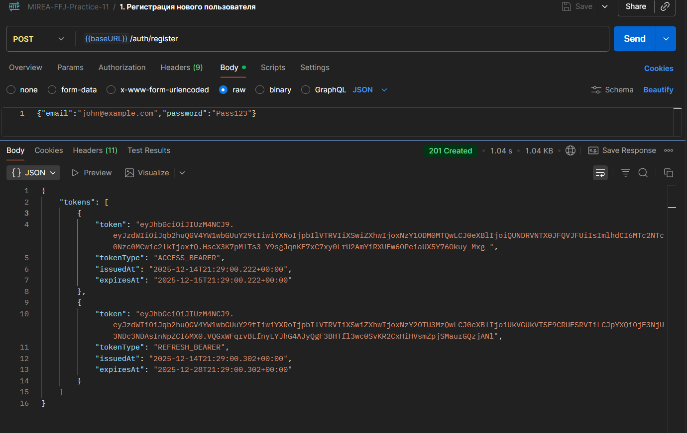

Результат: **HTTP 201 Created**, пользователь зарегистрирован, возвращены ACCESS и REFRESH токены.

#### 2. Вход в систему

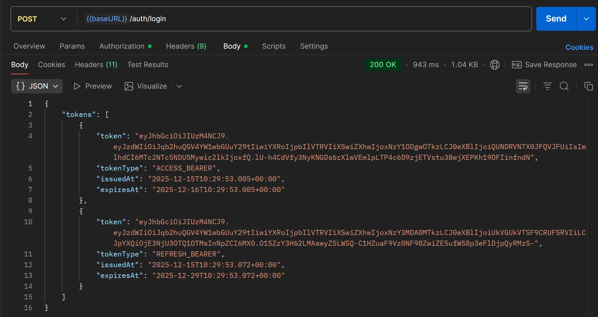

Результат: **HTTP 200 OK**, пользователь аутентифицирован, возвращены ACCESS и REFRESH токены.

#### 3. Создание заметки

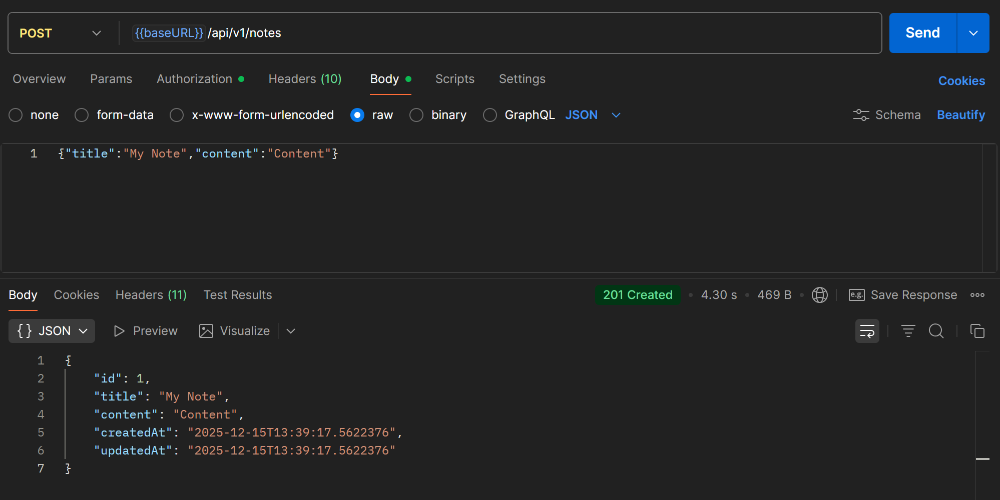

Результат: **HTTP 201 Created**, заметка создана с автоматическим проставлением createdAt и updatedAt.

#### 4. Получить все заметки

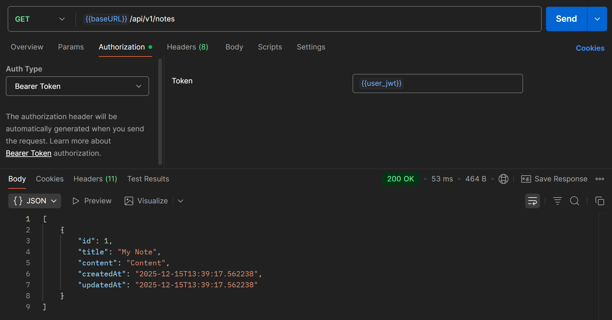

Результат: **HTTP 200 OK**, возвращен список всех заметок пользователя.

#### 5. Получить заметку по ID

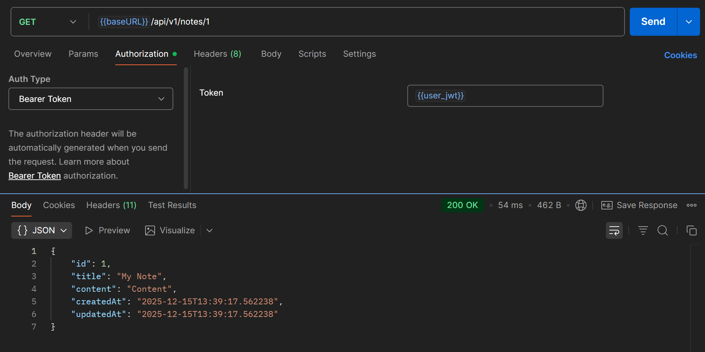

Результат: **HTTP 200 OK**, возвращена информация о конкретной заметке.

#### 6. Полностью обновить заметку (PUT)


Результат: **HTTP 200 OK**, заметка полностью заменена, обновлены поля, проставлен новый updatedAt.

#### 7. Частично обновить заметку (PATCH)

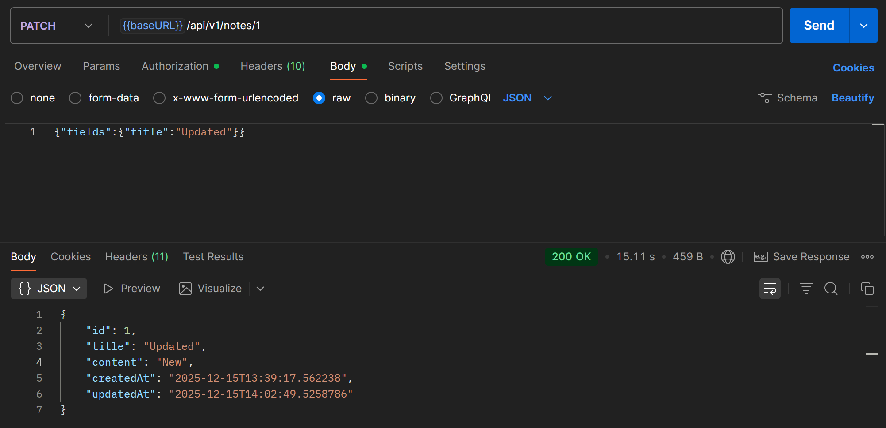

Результат: **HTTP 200 OK**, только указанные поля обновлены, остальные остались неизменны.

#### 8. Удалить заметку

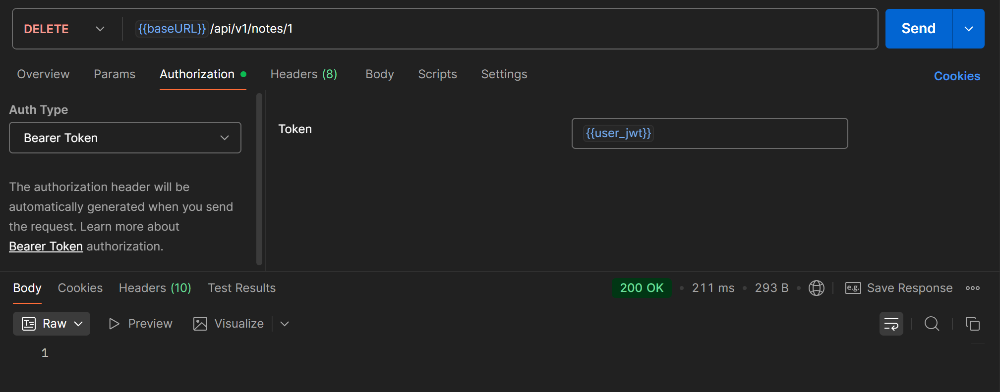

Результат: **HTTP 200 OK**, заметка успешно удалена из БД.

#### 9. Обновить ACCESS token через REFRESH

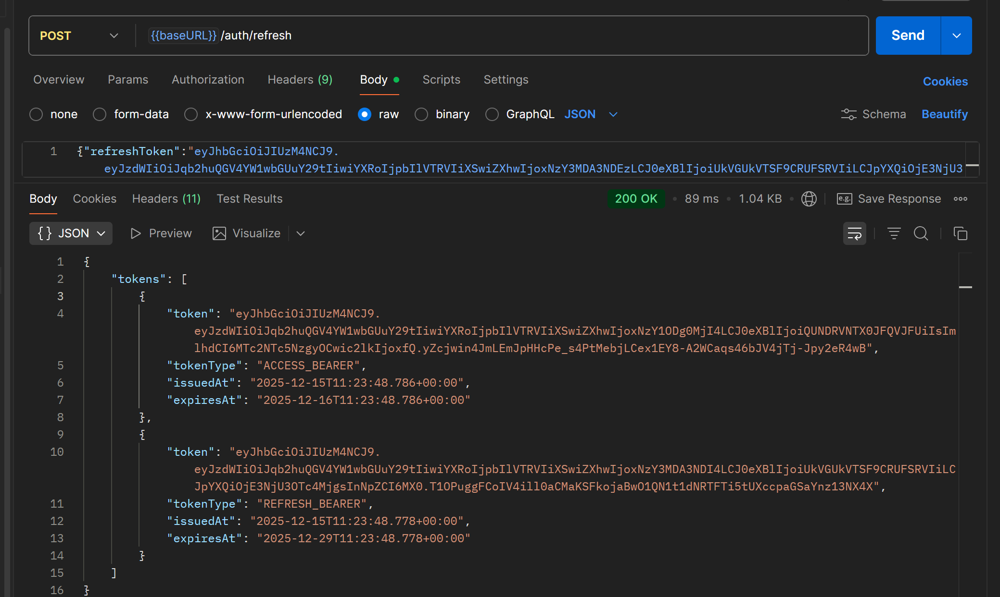

Результат: **HTTP 200 OK**, выданы новые ACCESS и REFRESH токены, старый REFRESH удален из Redis.

#### 10. Выход из системы

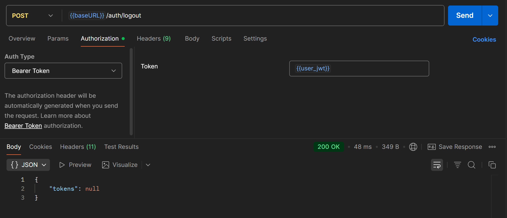

Результат: **HTTP 200 OK**, REFRESH token удален из Redis, пользователь разлогинен.

#### 11. Health check сервера

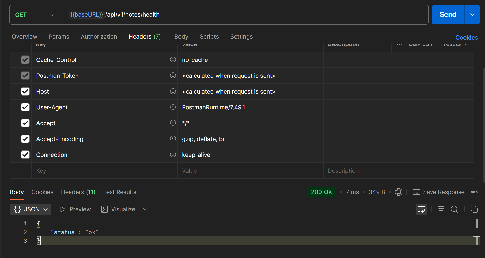

Результат: **HTTP 200 OK**, сервер отвечает с статусом "ok".


#### 12. Доступ к Swagger UI

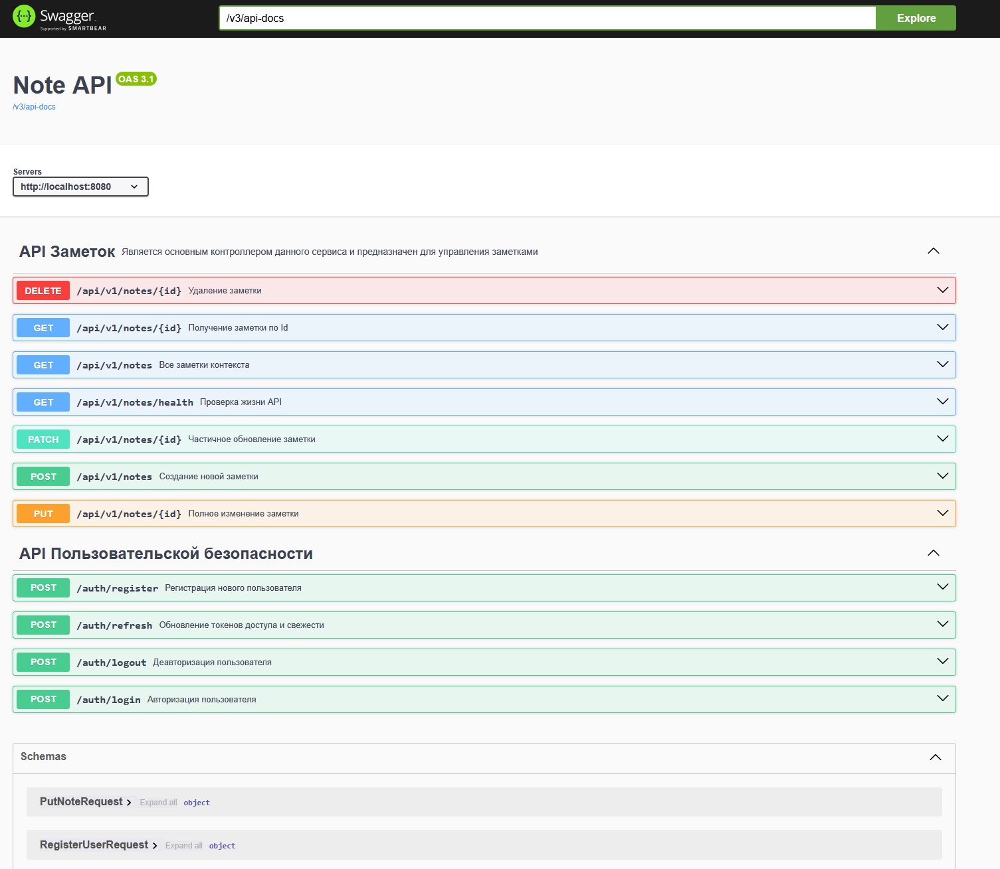

Результат: **HTTP 200 OK**, загружается интерактивная документация со всеми эндпоинтами, схемами и примерами. Функция "Try it out" позволяет прямо из браузера отправлять запросы к API.

## Настройка сервера

### Переменные окружения

Для корректной работы приложения необходимо указать следующие переменные окружения в файле `application.properties` или через переменные окружения системы:

| Переменная окружения | Описание | Пример |
|------------|----------|----------|
| REDIS_HOST | Хост Redis сервера | localhost |
| REDIS_PORT | Порт Redis сервера | 6379 |
| REDIS_PASSWORD | Пароль Redis (если требуется) | password |
| DB_URL | URL подключения к PostgreSQL | jdbc:postgresql://localhost:5432/practice12_db |
| DB_USER | Имя пользователя БД | postgres |
| DB_PASSWORD | Пароль пользователя БД | password |

**Конфигурация в application.properties:**
```properties
spring.redis.host=${REDIS_HOST}
spring.redis.port=${REDIS_PORT}
spring.redis.password=${REDIS_PASSWORD}
spring.datasource.url=${DB_URL}
spring.datasource.username=${DB_USER}
spring.datasource.password=${DB_PASSWORD}
```

## Дополнительно

### Что нового в Practice-12 (OpenAPI/Swagger)

#### 1. SpringDoc OpenAPI интеграция

Добавлена зависимость в `pom.xml`:
```xml
<dependency>
    <groupId>org.springdoc</groupId>
    <artifactId>springdoc-openapi-starter-webmvc-ui</artifactId>
    <version>2.8.5</version>
</dependency>
```

Позволяет:
- Автоматическую генерацию OpenAPI схемы
- Интеграцию Swagger UI из коробки
- Документирование через аннотации

#### 2. SwaggerConfig (новый конфиг)

```java
@Configuration
public class SwaggerConfig {
    @Bean
    public OpenAPI openAPI() {
        return new OpenAPI()
            .servers(List.of(new Server().url("http://localhost:8080")))
            .info(new Info().title("Note API"));
    }
}
```

Задает:
- Основной URL сервера
- Название API
- Можно добавить версию, описание, контакты

#### 3. @Schema аннотации на DTO

Пример для `CreateNoteRequest`:
```java
@Schema(
    name = "title",
    description = "Заголовок/название новой заметки",
    example = "My Note",
    requiredMode = Schema.RequiredMode.REQUIRED,
    minLength = 1,
    maxLength = 50
)
@NotBlank
@Size(min = 1, max = 50)
private String title;
```

Документирует:
- Название поля
- Описание
- Примеры
- Обязательность
- Валидационные правила (минимум, максимум)

#### 4. @Operation и @ApiResponse на контроллерах

Пример для создания заметки:
```java
@Operation(
    summary = "Создание новой заметки",
    description = "Новая заметка создается и добавляется в базу данных...",
    requestBody = @io.swagger.v3.oas.annotations.parameters.RequestBody(
        description = "В теле запроса передаются данные создаваемой заметки",
        required = true,
        content = @Content(
            mediaType = "application/json",
            schema = @Schema(implementation = CreateNoteRequest.class),
            examples = {
                @ExampleObject(
                    name = "Пример тела заметки",
                    value = "{\"title\":\"My Note\",\"content\":\"Content\"}"
                )
            }
        )
    ),
    responses = {
        @ApiResponse(
            responseCode = "201",
            description = "Заметка успешно создана...",
            content = @Content(
                mediaType = "application/json",
                examples = {...}
            )
        ),
        @ApiResponse(
            responseCode = "400",
            description = "Переданы невалидные данные...",
            content = @Content(...)
        ),
        @ApiResponse(
            responseCode = "403",
            description = "Forbidden - Доступ к ресурсу запрещен",
            content = @Content()
        )
    }
)
@PostMapping
ResponseEntity<NoteDTO> addNote(@RequestBody @Valid CreateNoteRequest createNoteRequest);
```

Документирует:
- Описание операции
- Примеры запросов
- Все возможные ответы (200, 201, 400, 401, 403, 404, 409)
- Примеры для успеха и ошибок
- Обязательность токена

#### 5. @Tag на контроллерах

```java
@Tag(
    name = "API Заметок",
    description = "Является основным контроллером данного сервиса и предназначен для управления заметками"
)
public interface NoteController extends HealthController {
    // методы
}
```

Группирует все методы контроллера в одной группе в Swagger UI.

#### 6. SecurityConfig обновлен

Добавлены разрешения для Swagger:
```java
.requestMatchers(
    "/swagger-ui/**",
    "/v3/**",
    "/swagger-ui.html",
    "/webjars/**",
    "/swagger-resources/**",
    "/configuration/**"
).permitAll()

.requestMatchers("/actuator/**").permitAll()
```

Позволяет доступ к документации без JWT токена.

#### 7. Spring Boot Actuator

Добавлена зависимость для мониторинга:
```xml
<dependency>
    <groupId>org.springframework.boot</groupId>
    <artifactId>spring-boot-starter-actuator</artifactId>
</dependency>
```

Предоставляет:
- `/actuator/health` — статус приложения
- `/actuator/metrics` — метрики
- Интеграция с OpenAPI для документирования endpoints

### Теоретические основы OpenAPI и Swagger

#### Что такое OpenAPI?

OpenAPI (ранее Swagger) — это стандартная спецификация для описания REST API. Позволяет:
- Документировать API в машиночитаемом формате (JSON/YAML)
- Автоматически генерировать UI для тестирования (Swagger UI)
- Генерировать клиентские библиотеки и SDK
- Валидировать соответствие API спецификации

#### Преимущества OpenAPI

- **Автоматизация** — документация генерируется из кода
- **Стандартизация** — единый формат для всех REST API
- **Интерактивность** — Swagger UI для "Try-it-out"
- **Tooling** — интеграция с IDE, Postman, сторонними сервисами
- **Контракт** — четкий контракт между frontend и backend

#### Swagger UI функции

- **Просмотр всех эндпоинтов** — группировка по тегам (@Tag)
- **Схема запроса/ответа** — визуализация структуры данных
- **Примеры** — предопределенные примеры для каждого эндпоинта
- **Try-it-out** — отправка реальных запросов из браузера
- **Авторизация** — поддержка Bearer token в заголовке
- **Скачивание JSON** — экспорт спецификации для импорта в Postman

#### Аннотирование процесс

1. На DTO полях — `@Schema` для документирования структуры
2. На контроллер-интерфейсе — `@Tag` для группирования
3. На методах — `@Operation` для описания операции
4. На ответах — `@ApiResponse` для каждого статуса
5. На параметрах — `@Parameter` для path/query параметров

#### Пример полного документирования

```java
@Tag(name = "Notes", description = "Управление заметками")
public interface NoteController {
    
    @Operation(
        summary = "Создать заметку",
        description = "Создает новую заметку и сохраняет в БД"
    )
    @ApiResponses({
        @ApiResponse(responseCode = "201", description = "Заметка создана"),
        @ApiResponse(responseCode = "400", description = "Невалидные данные"),
        @ApiResponse(responseCode = "401", description = "Не авторизирован")
    })
    @PostMapping("/notes")
    ResponseEntity<NoteDTO> createNote(@RequestBody @Valid CreateNoteRequest req);
}
```

### Контрольные вопросы

#### 1. Чем OpenAPI отличается от Swagger?

- **Swagger** — первоначальное название (устаревшее)
- **OpenAPI** — официальное название стандарта (версия 3.0+)
- **Swagger UI** — инструмент визуализации OpenAPI спецификации
- В контексте Java: SpringDoc OpenAPI = библиотека для генерации OpenAPI из аннотаций

#### 2. Зачем документировать API через аннотации?

- **DRY принцип** — документация живет в коде
- **Синхронизация** — при изменении кода обновляется документация
- **Примеры** — примеры в кода = актуальные примеры в документации
- **Интерактивность** — Swagger UI для тестирования

#### 3. Как использовать Swagger для тестирования?

1. Открыть http://localhost:8080/swagger-ui/index.html
2. Раскрыть нужный эндпоинт (click на "POST /auth/login")
3. Нажать "Try it out"
4. Заполнить поля (or use pre-filled examples)
5. Нажать "Execute"
6. Увидеть curl команду, запрос, ответ

#### 4. Можно ли импортировать OpenAPI schema в Postman?

**Да!** В Postman:
1. Файл → Импорт
2. URL: http://localhost:8080/v3/api-docs
3. Postman создаст коллекцию со всеми запросами

#### 5. Как скрыть некоторые эндпоинты из документации?

Использовать `@Hidden` аннотацию:
```java
@Hidden
@GetMapping("/internal")
ResponseEntity<?> internalEndpoint();
```

#### 6. Как документировать параметры безопасности?

```java
@Operation(
    summary = "Получить заметку",
    security = @SecurityRequirement(name = "bearerAuth")
)
@GetMapping("/{id}")
ResponseEntity<NoteDTO> getNoteById(@PathVariable Long id);
```

#### 7. Какие OpenAPI версии поддерживает SpringDoc?

- **OpenAPI 3.0** — текущий стандарт (поддерживается)
- **OpenAPI 3.1** — новый стандарт (поддерживается в свежих версиях)
- **Swagger 2.0** — старый стандарт (deprecated)

## Выводы

В результате выполнения практического занятия №12 был разработан полнофункциональный REST API сервис для управления заметками с интеграцией JWT аутентификации и OpenAPI документации. Проект демонстрирует production-ready подход с документированием API и интерактивной поддержкой Swagger UI для тестирования.

**Достигнутые результаты:**

- Интегрирована библиотека SpringDoc OpenAPI 2.8.5 с поддержкой Swagger UI
- Все DTO запросов и ответов задокументированы через @Schema аннотации
- Все контроллеры аннотированы @Tag, @Operation, @ApiResponse с примерами
- Swagger UI доступен по адресу http://localhost:8080/swagger-ui/index.html
- Реализована интерактивная документация с примерами запросов/ответов
- Все HTTP статусы (200, 201, 400, 401, 403, 404, 409) документированы
- Spring Security настроен для разрешения доступа к Swagger endpoints
- Все функции из Practice-11 сохранены и работают идентично
- OpenAPI schema автоматически генерируется по адресу /v3/api-docs
- Поддержка примеров ошибок и успешных ответов в каждом эндпоинте

**Приобретённые навыки:**

- Использование SpringDoc OpenAPI для автоматической генерации документации
- Аннотирование DTO через @Schema для описания полей и валидации
- Создание полной документации контроллеров через @Operation и @ApiResponse
- Использование @ExampleObject для предоставления примеров запросов/ответов
- Интеграция Spring Boot Actuator с OpenAPI
- Настройка OpenAPI конфигурации через SwaggerConfig бин
- Разрешение Swagger endpoints в Spring Security (permitAll)
- Работа с интерактивным Swagger UI для тестирования эндпоинтов
- Try-it-out функциональность в Swagger для отправки реальных запросов
- Документирование параметров пути, тела запроса и заголовков
- Экспорт OpenAPI спецификации для импорта в Postman или другие инструменты
- Группирование эндпоинтов через @Tag для лучшей организации
- Использование @Parameter для документирования пути и query параметров

Проект готов к production использованию с полной API документацией и поддержкой интерактивного тестирования через Swagger UI. Документация живет в коде и автоматически обновляется при изменении реализации.
